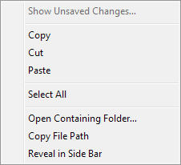
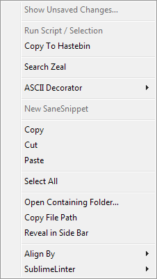
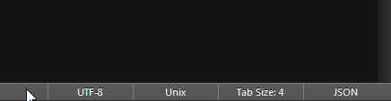

=======
 Menus
=======

.. seealso::

   :doc:`Reference for menus </reference/menus>`
      Reference for menu creation.

Sublime Text provides several menus
that can be modified,
for example, by adding menu items.

File Format
===========

=============  ===========================================
**Format**     JSON (with comments)

**Extension**  ``.sublime-menu``

**Name**       One out of the list of available menus.
               See :ref:`menu-types` for the complete name list
               and what menu each name represents.

**Location**   Any under :file:`{Packages}`

**Content**    A list of :ref:`menu-items`
=============  ===========================================

Example
*******

The following is an excerpt
from the default :file:`Main.sublime-menu` file.

.. code-block:: json

   [
       {
           "caption": "Edit",
           "mnemonic": "E",
           "id": "edit",
           "children":
           [
               { "command": "undo", "mnemonic": "U" },
               { "command": "redo_or_repeat", "mnemonic": "R" },
               {
                   "caption": "Undo Selection",
                   "children":
                   [
                       { "command": "soft_undo" },
                       { "command": "soft_redo" }
                   ]
               },
               { "caption": "-", "id": "clipboard" },
               { "command": "copy", "mnemonic": "C" },
               { "command": "cut", "mnemonic": "t" },
               { "command": "paste", "mnemonic": "P" },
               { "command": "paste_and_indent", "mnemonic": "I" },
               { "command": "paste_from_history", "caption": "Paste from History" }
           ]
       }
   ]

Images
******

   The default context menu in the editing area.

   A modified context menu in the editing area.

.. _menu-types:

Available Menus
===============

The file name
of a ``.sublime-menu`` file
specifies the menu to be modified
in the application.

The following menus are available:

========================   ===============
     File/Menu Name          Description
========================   ===============
**Main**                   Main menu

**Context**                Context menu in the editing area

**Find in Files**          Appears when clicking the "…" button
                           in the :doc:`Find in Files
                           </search_and_replace/search_and_replace_files>`
                           panel.

**Side Bar**               Context menu for each node in the sidebar

**Side Bar Mount Point**   Additional context menu items
                           for the top-level nodes in the sidebar

**Tab Context**            Context menu of the tab bar

**Widget Context**         Context menu of input fields
                           in all kinds of widgets,
                           including Command Palette, Goto Anything,
                           the Find panels
                           and panels opened by plugins
========================   ===============

Additionally,
the following four menus open
when you click their respective section
in the status bar:

- **Encoding**
- **Line Endings**
- **Indentation**
- **Syntax**

   Demonstration of a status bar menu.

.. _menu-items:

Menu Items
==========

When selected,
a menu item can either
invoke a command (with arguments),
or open a submenu.

The available properties are:

- a command name,
- arguments for the command,
- an ID,
- a caption,
- a mnemonic and
- a submenu.

In order to function properly,
a menu item must provide at least:

- a command name,
- a caption and a submenu,
- just a caption, or
- an ID (see :ref:`below <item-ids>`).

When parsing a menu item,
the following rules apply:

#. A menu item with a submenu
   cannot invoke a command.
   If the :ref:`separator caption <menu-separators>` is used,
   it will be rendered as a literal hyphen.

#. If no caption is provided,
   a caption is inferred
   from the command's ``description`` method.
   If neither caption nor command are provided,
   the caption will be an empty string.

#. The character used for the mnemonic
   must be contained in the item's caption.
   Mnemonics are case-sensitive.

#. Menu that reference missing commands
   are disabled.

#. Menu items can be hidden or disabled
   by their referenced command.

.. TODO add refs to Command methods

.. _menu-separators:

Separators
**********

Separators are menu items
with the caption ``-``
and no submenu.
They are commonly used
to group menu items with a similar purpose
or that are otherwise related.
Separators cannot invoke commands.
The presence of a submenu
causes the menu separator
to be rendered as a regular item
with a single hyphen as its caption.

Multiple consecutive separators are reduced to one,
and separators at the beginning or the end of a menu
are not displayed.

.. _menu-merging:

Menu Merging
============

``.sublime-menu`` files are loaded
in the same order as packages.
Menu files with the same name are concatenated,
unless IDs are specified
(see :ref:`below <item-ids>`).

Menu files in the same package
are loaded in lexicographical order
starting at the root folder,
and then traversing sub-folders in the same manner.

As a special case,
menu items from the *User* package
declared in the standard non-ID section of a menu
are always inserted after any standard items
from other packages.

.. _item-ids:

Item IDs
********

When a menu item specifies an ID,
a separate section within the menu is searched for
and, if it does not exist,
created at the end of the menu.
This ID lookup is forward-going only.

The ID determines the section's name,
and the menu item with the matching ID
will be the first item in this section.
All following items in the file
will then be appended to the ID's section,
until another item with an ID is found.

If two menu items
from different ``.sublime-menu`` files
reference the same item via ID,
Sublime Text will override the item's previous parameters
with the new parameters,
if there are any.
Child elements extend the submenu.
All following items are then appended to the ID's section,
until another item with an ID is found.

It is common practice
to assign IDs to separators
and items having a submenu,
so that other packages or the user themselves
can easily customize the menu.
This allows appending items to sections introduced by separators
and appending items to submenus.

.. note::

   Due to the strict forward lookup,
   it is possible to have
   *multiple different items with the same ID*
   in one menu.
   Because of the potential confusion this may cause,
   it is discouraged.

   Example:
   The following three IDs
   are defined in a menu, in this order:
   ``test, test2, test``.

   The item with the second "test" ID
   can then be targeted
   using the following ID combinations:
   ``test, test2, test``; ``test, test`` or ``test2, test``.

Submenus
========

Every menu item can have a submenu.
Hovering the mouse pointer
over a menu item with a submenu
will reveal the items grouped under it.
Submenus are independent menus
with their own ID hierarchy.

In order to extend a submenu
from a different menu file,
an ID must be specified in both places
to target the correct item.

The Main Menu
=============

Unlike all other menus,
the Main Menu's root menu
represents the menu items in the menu bar
(File, Help, etc.).

Interface for Commands
======================

A menu item can be dynamically

- hidden,
- disabled,
- checked, or
- assigned a different caption.

For this,
commands must implement the required methods in their class.
The methods are either called with the same arguments
as the actual command would be
(except for ``edit`` in ``TextCommand``\ s),
or none at all.

.. XXX want_event() exception

- ``is_visible``
- ``is_enabled``
- ``is_checked``
- ``description``

Some of these methods also have an influence
on the Command Palette.

.. seealso::

   `Official API Documentation on the Command interface`__

   .. __: http://www.sublimetext.com/docs/3/api_reference.html#sublime_plugin.ApplicationCommand

Context Menus in the Side Bar
=============================

The **Side Bar** and **Side Bar Mount Point** menus
are different to the other menus
in that they provide **contextual information**
regarding the selected item(s).
The selected directories and files
are passed as a list to the specified command
in a ``files`` argument.
