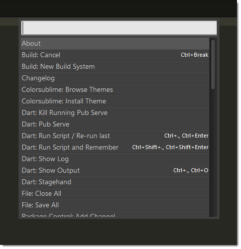

===============
Command Palette
===============

.. seealso::

   :doc:`Reference for Command Palette <../reference/command_palette>`
      Complete documentation on the command palette options.

.. _ext-command-palette-overview:

Overview
========

The *command palette* is an interactive list
whose purpose is to execute commands.
The command palette is fed entries
by means of ``.sublime-commands`` files.
Commands that don't warrant
creating a key binding of their own
are usually good candidates
for inclusion in a ``.sublime-commands`` file.

  The Command Palette

By default,
the command palette includes many useful commands
and provides convenient access
to individual settings as well as settings files.

To use the command palette:

#. Press :kbd:`Ctrl+Shift+P`
#. Select a command
#. Press :kbd:`Enter`

The command palette filters entries by context.
This means that
whenever you open it,
you won't always see all the commands
defined in every ``.sublime-commands`` file.

Example of a ``.sublime-commands`` File
=======================================

.. include:: ../common/command-palette-example-0.txt

