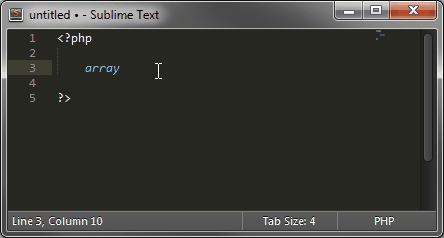

===========
Completions
===========

In the spirit of IDEs,
Sublime Text suggests completions
that aggregate code or content while writing
by catching everything that you have written,
like variable names.

There are however several ways
to extend the list of completions
(for example, depending on the current syntax).

This topic deals with
how completions are used and
where they come from.

How to Use Completions
======================

There are two methods for using completions.
Even though, when screening them,
the priority given to completions always stays the same,
the two methods produce different results.

Completions can be inserted in two ways:

* through the completions list :

  * :kbd:`Ctrl + Spacebar` on Windows / OS X,
  * :kbd:`Alt + /` on Linux

* or by pressing :kbd:`Tab`.

The Completions List
********************

To use the completions list:

1. Press :kbd:`Ctrl + Spacebar` (:kbd:`Alt + /` on Linux)
   or just type something.
#. Optionally, press the shortcut again
   to select the next entry
   or use *up* and *down* arrow keys.
#. Press :kbd:`Enter` or :kbd:`Tab` to validate selection
   (depending on the ``auto_complete_commit_on_tab`` setting)
#. Optionally, press :kbd:`Tab` repeatedly
   to insert the next available completion.

.. note::

   If the completions list was opened explicitly,
   the current selection
   in the completions list
   can also be validated
   with any punctuation sign
   that isn't itself bound to a snippet (e.g. ``.``).

When the list of completion candidates
can be narrowed down to one unambiguous choice
given the current prefix,
this one completion will be validated automatically
the moment you trigger the completion list.

Hints
-----

Additionally,
you may see a trigger hint
on the right side of a completion's trigger
in the completions list.
This can be used as a preview
of the completion's content.

.. image:: images/completions_hint.png

The above is in fact a snippet
and expands to
``$arrayName = array('' => , );``.

Triggers and Contents
*********************

Completions not sourced from the text in the current file
may provide a trigger
that is different
to the content they will insert if selected.
This is commonly used for function completions
where the content also includes
the function's signature.

For example,
completing ``array_map`` from the PHP completions
will result in :samp:`array_map({callback}, {arr1})`:

You may notice in the animation
that the cursor automatically selected ``callback``.
This is because completions support
the same features as snippets
with fields and placeholders.
For more details, refer to :ref:`snippet-features`.

.. _completions-multi-cursor:

Completions with multiple cursors
*********************************

Sublime Text can also handle completions with multiple cursors
but will only open the completion list
when all cursors share the same text
between the current cursor positions
and the last word separator character
(e.g. ``.``  or a line break).

Working example (``|`` represents one cursor)::

   l|
   some text with l|
   l| and.l|

Not working example::

   l|
   some text with la|
   l| andl|

Selections are essentially ignored,
only the position of the cursor matters.
Thus, ``e|[-some selection] example``,
with ``|`` as the cursor and ``[...]`` as the current selection,
completes to ``example|[-some selection] example``.

:kbd:`Tab`-Completed Completions
********************************

If you want to be able to tab-complete completions,
the setting ``tab_completion`` must be set to ``true`` (default).
Snippet tab-completion is unaffected by this setting:
They will always be completed
according to their tab trigger.

With ``tab_completion`` enabled,
completion of items is always automatic.
This means, unlike the case of the completions list,
that Sublime Text will always make the decision for you.
The rules for selecting the best completion
are the same as described above,
but in case of ambiguity,
Sublime Text will insert the item it deems most suitable.
You can press the :kbd:`Tab` key multiple times
to walk through other available options.

Inserting a Literal Tab Character
---------------------------------

When ``tab_completion`` is enabled,
you can press :kbd:`Shift + Tab` to insert
a literal tab character.

Sources for Completions and their Priorities
============================================

These are the sources for completions
the user can control,
in the order they are prioritized:

1. :doc:`/extensibility/snippets`
#. API-injected completions
   via :py:meth:`~sublime_plugin.EventListener.on_query_completions`
#. :doc:`Completions files </reference/completions>`

Additionally,
the following completions
are folded into the final list:

4. Words in the buffer

Snippets will always win
when the current prefix
matches their tab trigger *exactly*.
For the rest of the completion sources,
a fuzzy match is performed.
Furthermore,
snippets always lose in a fuzzy match.

When a list of completions is shown,
snippets will still be listed alongside the other items,
even if the prefix only partially matches
the snippets' tab triggers.

.. note::

   Completions sourced from words in the buffer
   can be suppressed explicitly
   from an ``on_query_completions`` event hook.
