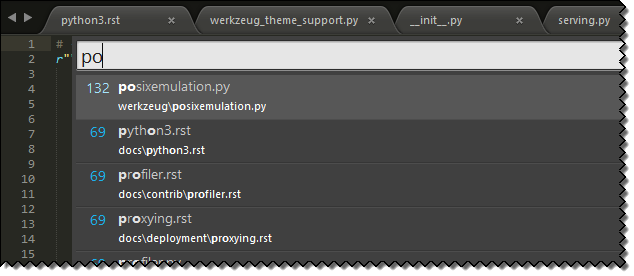
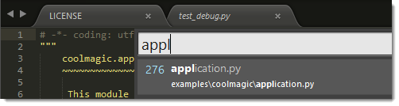

===================================
File Navigation and File Management
===================================

Sublime Text includes a variety of features
to help you keep your work organized
and find your way around your projects.

.. contents::
    :local:
    :depth: 2

.. _fm-goto-anything:

Goto Anything
=============

Use Goto Anything
to **navigate your project's files** swiftly.
(More about projects later.)

Keyboard shortcuts related to Goto Anything:

+------------------------+------------------------+
| **Open Goto Anything** | Ctrl + P               |
+------------------------+------------------------+
| Pin current item and   | Enter                  |
| close Goto Anything    |                        |
+------------------------+------------------------+
| Pin current item       | →                      |
+------------------------+------------------------+
| Close Goto Anything    | Esc                    |
+------------------------+------------------------+

As you type into Goto Anything's input area,
names of files in the current project
will be searched,
and a preview of the best match
will be shown.
This preview is *transient*;
that is, it won't become the actual active view
until you perform some operation on it.
You will find transient views in other situations,
for example, after clicking on a file in the sidebar.

Goto Anything lives up to its name
--there's more to it than locating files.

Goto Anything Operators
-----------------------

Goto Anything accepts several operators.
All of them can be used
on their own or after the search term.

Example::

	models:100

This instructs Sublime Text
to first search for a file
whose path matches ``models``,
and then to go to line 100 in said file.

Supported Operators
^^^^^^^^^^^^^^^^^^^

.. _fm-goto-symbol:

:samp:`@{symbol}`
    Searches  the active file
    for the symbol named ``symbol``.

    .. note::

        Symbols usually include class and function names.

        Symbol searches will only yield results
        if the active file type
        has symbols defined for it.
        Symbols are defined in ``.tmLanguage`` files.
        For more information about symbols,
        see :doc:`../reference/symbols`.

..    See *Symbols - Syntax Preferences*
..    (TODO: to be added).

:samp:`#{term}`
    Performs a fuzzy search of the ``term`` search term
    and highlights all matches.

:samp:`:{line_number}`
    Goes to the specified ``line_number``,
    or to the end of the file
    if ``line_number`` is larger
    that the file's line count.

The Goto Anything operators
are bound to the following shortcuts:

+--------+-----------+
| **@**  | Ctrl + R  |
+--------+-----------+
| **#**  | Ctrl + ;  |
+--------+-----------+
| **:**  | Ctrl + G  |
+--------+-----------+

.. _fm-sidebar:

Sidebar
=======

The sidebar provides an overview
of the active project
(more on projects later).
Files and folders in the sidebar
will be available in `Goto Anything`_
and project-wide actions
like, for example, project-wide searches.

.. TODO: maybe say "Find in Files" instead.

Projects and the sidebar are closely related.
It's important to note
that there's always an active project,
whether it's explicit or implicit.

The sidebar provides basic file management operations
through its context menu.

These are common keyboard shortcuts
related to the side bar:

+----------------------------------+-----------------------+
| **Toggle side bar**              | Ctrl + K, Ctrl + B    |
+----------------------------------+-----------------------+
| Give the focus to the side bar   | Ctrl + 0              |
+----------------------------------+-----------------------+
| Return the focus to the view     | Esc                   |
+----------------------------------+-----------------------+
| Navigate side bar                | Arrow keys            |
+----------------------------------+-----------------------+

Files opened from the sidebar
create *semi-transient* views.
Unlike transient views, semi-transient views
show up as a new tab.
The tab title of semi-transient views appears in italics.
Before a new semi-transient view is opened,
any other pre-existing semi-transient view in the same pane
gets automatically closed.

Here's an example showing a normal view, a transient view,
and a semi-transient view.
Notice that the transient view has no tab:

.. _fm-projects:

Projects
========

Projects group sets of files and folders
to keep your work organized.

There is always an active project.
If you haven't created one,
an implicit one is created by Sublime Text.

Set up a project in a way
that suits you by adding folders,
and then save your new configuration.

.. _fm-projects-folders:

You can add and remove folders to/from a project
using the **Project** menu
or the side bar's context menu.
If you drag a folder onto a Sublime Text window,
it will be added to the project too.

To save a project,
go to **Project → Save Project As...**.

Using the menu,
you can switch projects
by selecting **Projects → Recent Projects**.

Keyboard shortcuts related to projects:

+----------------------------------+-----------------------+
| **Switch project**               | Ctrl + Alt + P        |
+----------------------------------+-----------------------+

Project metadata is stored in JSON files
with a ``.sublime-project`` extension.
Wherever there's a ``.sublime-project`` file,
you will find an ancillary ``.sublime-workspace`` file too.
The second one is used by Sublime Text
and you shouldn't edit it.
(More on workspaces later.)

Projects can define settings applicable to that project only.
See the `official documentation`_ for more information.

.. _official documentation: http://www.sublimetext.com/docs/2/projects.html

.. TODO add settings example here.

You can open a project from the **command line**
by passing the ``.sublime-project`` file as an argument
to the ``subl`` command line helper
included with Sublime Text.

.. warning::

    Generally speaking,
    it's fine to commit ``.sublime-project`` files
    to a source code repository,
    but always be mindful of what you store in them.

The ``.sublime-project`` Format
-------------------------------

Project metadata in ``.sublime-project`` files
is split across three topmost sections:
``folders``, for the included folders; ``settings``,
for project-specific settings;
and ``build_systems``, for project-specific build systems.

.. code-block:: javascript
    :emphasize-lines: 2,14,18

    {
        "folders":
        [
            {
                "path": "src",
                "folder_exclude_patterns": ["backup"]
            },
            {
                "path": "docs",
                "name": "Documentation",
                "file_exclude_patterns": ["*.css"]
            }
        ],
        "settings":
        {
            "tab_size": 8
        },
        "build_systems":
        [
            {
                "name": "List",
                "cmd": ["ls"]
            }
        ]
    }

**Folder Options**

``path``
    Required.
    The path may be relative to the project directory,
    or absolute.

``name``
    Optional. If present, it will appear in the side bar.

``folder_exclude_patterns``
    Optional. List of wildcards.
    Folders matching the wildcards will be excluded from the project.

``folder_include_patterns``
    Optional. List of wildcards.
    Folders matching the wildcards will be included in the project.

``file_exclude_patterns``
    Optional. List of wildcards.
    Files matching the wildcards will be excluded from the project.

``file_include_patterns``
    Optional. List of wildcards.
    Files matching the wildcards will be included in the project.

.. TODO: there are more settings supported by projects.

**Settings**
    A project may define project-specific settings
    that will only apply to files within that project.
    Project-specific settings override user settings,
    but not syntax-specific settings.

    Almost all settings can be overridden
    (excluding global settings).

    .. seealso::

        :ref:`settings-hierarchy`
            A detailed example for the order of precedence for settings.
        :doc:`Settings - Reference </reference/settings>`
            Reference of available settings.

**Build Systems**
    You can define project-specific build systems
    in a ``.sublime-project`` file.
    A ``name`` must be specified for each one.
    Build systems included in a ``.sublime-project`` file
    will show up in the **Tools → Build Systems** menu.

    .. seealso::

        :doc:`Build Systems - Reference </reference/build_systems>`
            Documentation on build systems and their options.

Other Settings Related to the Sidebar and Projects
==================================================

``binary_file_patterns``
    A list of wildcards.
    Files matching these wildcards will show up in the side bar,
    but will be excluded from Goto Anything
    and Find in Files.

.. TODO: Find in Files seems to be the official name for 'project-wide search'
.. TODO: binary_file_patterns also applies to projects, right?

Workspaces
==========

Workspaces can be seen as different *views*
into the same project.
For example, you may want
to have only a few selected files open
while working on some feature.
Or perhaps you use a different pane layout
when you're writing tests, etc.
Workspaces help in these situations.

Workspaces behave very much like projects.
To create a new workspace,
select **Project → New Workspace for Project**.
To save the active workspace,
select **Project → Save Workspace As...**.

To switch between different workspaces,
use :kbd:`Ctrl+Alt+P`,
exactly as you do with projects.

Workspaces metadata is stored in JSON files
with the ``.sublime-workspace`` extension.

.. TODO: is the stuff below true?

As with projects, you can open a workspace
from the **command line**
by passing the desired ``.sublime-workspace`` file
as an argument to the ``subl`` command line helper
included with Sublime Text.

.. warning::
    Unlike ``.sublime-project`` files,
    ``.sublime-workspace`` files
    are not meant to be shared or edited manually.
    **You should never commit** ``.sublime-workspace`` **files
    into a source code repository.**

Panes
=====

Panes are groups of views.
In Sublime Text, you can have
multiple panes open at the same time.

Main keyboard shortcuts related
to panes:

+-----------------------+--------------------+
| Create new pane       | Ctrl+K, Ctrl+↑     |
+-----------------------+--------------------+
| Close active pane     | Ctrl+K, Ctrl+↓     |
+-----------------------+--------------------+

Further pane management commands
can be found under **View → Layout**
and related submenus.
