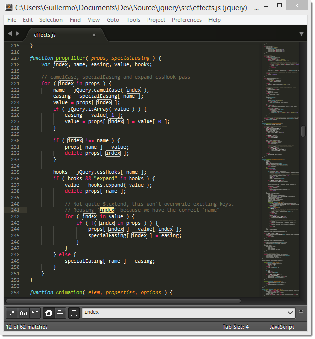

========================
About This Documentation
========================

Welcome to the unofficial documentation
for the Sublime Text editor!

`Sublime Text`_ is a versatile and fun text editor
for code and prose
that automates repetitive tasks
so you can focus the important stuff.
It works on OS X, Windows and Linux.

If you're starting out with Sublime Text,
read the :doc:`basic_concepts` section first.

Happy learning!

Contributing to the Documentation
=================================

If you want to contribute to this documentation,
head over to the `GitHub repo`_.
This guide has been created with `Sphinx`_.

.. _Sublime Text: http://www.sublimetext.com
.. _GitHub repo: https://github.com/guillermooo/sublime-undocs
.. _Sphinx: http://sphinx-doc.org/