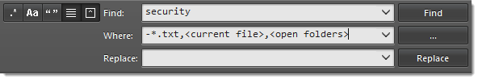
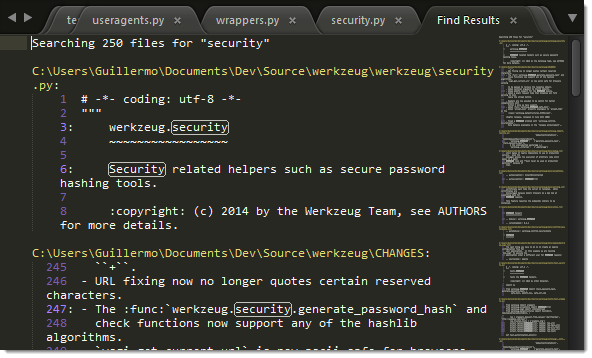
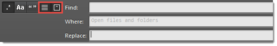

===================================
Search and Replace — Multiple Files
===================================

The search panel for searching multiple files is known as **Find in Files**.

.. _snr-search-files:

Searching
=========

Keyboard shortcuts related to Find in Files:

==========================   ================
**Open Find in Files**       Ctrl + Shift + F
Toggle regular expressions   Alt + R
Toggle case sensitivity      Alt + C
Toggle exact matches         Alt + W
Find next                    Enter
==========================   ================

.. _snr-search-scope-files:

Search Filters
==============

The **Where** field in Find in Files
limits the search scope.
You can define filters in several ways:

* Adding individual directories (Unix-style paths, even on Windows)
* Adding/excluding files based on wildcards
* Adding symbolic locations (``<open folders>``, ``<open files>``...)

Relative paths in filters are interpreted
to start at the root of the active project.

It is also possible
to combine filters using commas.
You can combine filters in any order.

   Combining **Where** scopes in Find in Files

Press the **...** button in the search panel
to display a menu containing filtering options.

.. _snr-results-format-files:

Results Format
==============

You can customize
how results are displayed
using buttons available in the Find in Files panel.
These are the available options:

.. TODO: add screenshot.

* Show in separate view (*Use Buffer*)
* Show context

   Find in Files results displayed in a view

   Buttons for customizing the Find in Files results

.. _snr-results-navigation-files:

Navigating Results
==================

If a search yields matches,
you can move through the sequence
using the following key bindings:

==============   =================
Next match       F4
Previous match   Shift + F4
==============   =================
