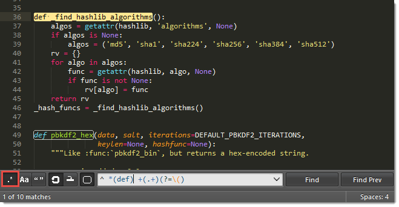

==================
Search and Replace
==================

Sublime Text features
two main types of search:

.. toctree::
   :maxdepth: 1

	Search - Single File <search_and_replace>
	Search - Multiple Files <search_and_replace_files>

Both support **regular expressions**,
a powerful tool for searching and replacing text.

.. _snr-regexes:

Regular Expressions
===================

Regular Expressions find complex *patterns* in text.
To take full advantage
of the search and replace facilities in Sublime Text,
you should at least learn
the basics of regular expressions.
In this guide
we won't explain how to use regular expressions.

The term *regular expression*
is usually shortened to *regexp* or *regex*.

This is how a regex might look::

	(?:Sw|P)i(?:tch|s{2})\s(?:it\s)?of{2}!

To use regular expressions in Sublime Text,
you first need to activate them in
the various search panels.
Otherwise, search terms will be interpreted literally.

Sublime Text uses the
Perl Compatible Regular Expressions (PCRE) engine
from the Boost library.

.. seealso::

	`Boost library documentation for regular expressions <http://www.boost.org/doc/libs/1_44_0/libs/regex/doc/html/boost_regex/syntax/perl_syntax.html>`_
		Documentation on regular expressions.

	`Boost library documentation for format strings <http://www.boost.org/doc/libs/1_44_0/libs/regex/doc/html/boost_regex/format/perl_format.html>`_
		Documentation on format strings. Note that Sublime Text additionally
		interprets :samp:`\\{n}` as :samp:`${n}`.
